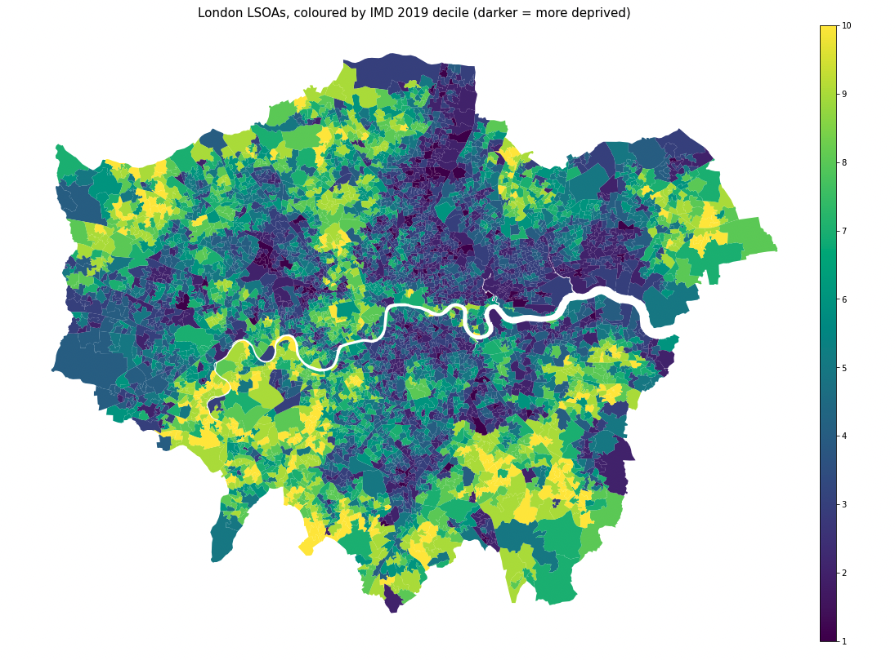
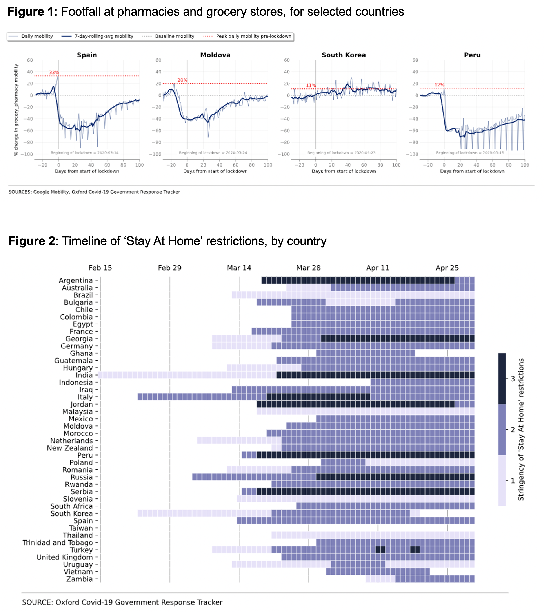
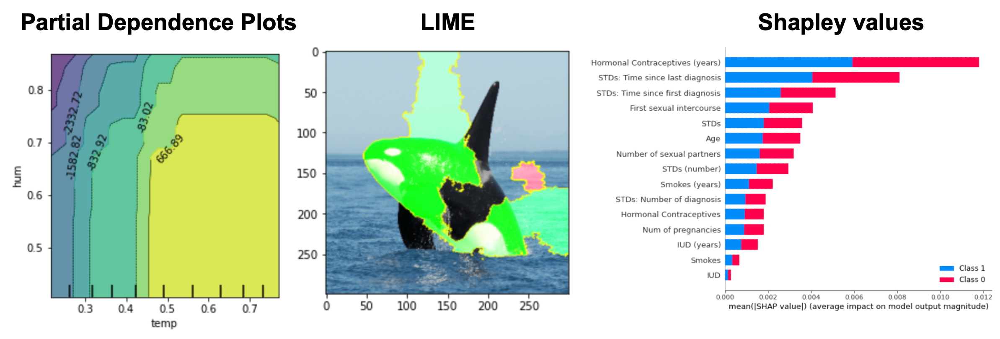
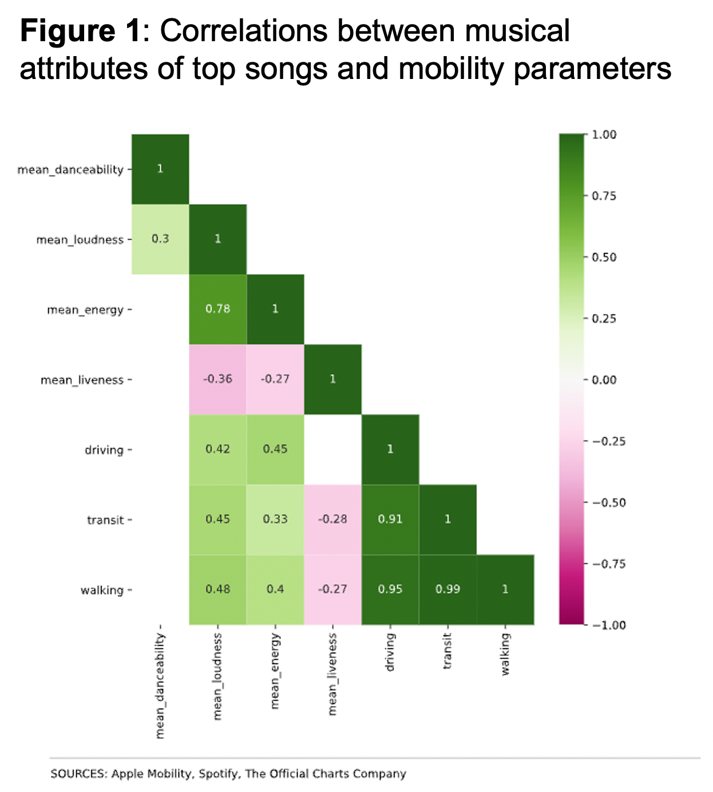

## Professional Summary

Fullstack data and analytics professional with 14+ years of end-to-end experience designing scalable data pipelines, deploying predictive and AI/ML models, and translating complex datasets into executive-facing insights. Proven expertise in Python, SQL, PySpark, and cloud platforms (GCP, Azure, AWS), with deep fluency in ETL/ELT architecture, data governance, NLP and LLM-powered automation, and advanced analytics. Experienced leading cross-functional teams and engaging directly with senior business stakeholders across Finance, Operations, and Product to define analytics strategy, implement sophisticated models within existing workflows, and drive measurable business outcomes. Adept at breaking down complex problems, communicating technical concepts to non-technical audiences, and operating independently across both lean and matrixed environments.

---

## Projects

### Data Engineering

*Projects coming soon.*

---

### Data Governance

*Projects coming soon.*

---

### Data Science, ML and AI

#### NLP : Emotions, Sentiment and Emotion Analysis

1. Emotions Word Cloud project
2. Sentiment Analysis, Emotion Analysis and scores
3. webscrape reddit

The project focuses on Natural Language Processing (NLP) with a primary objective of sentiment analysis and emotion analysis. The goal is to develop a robust system capable of accurately determining the sentiment expressed in textual data and identifying the underlying emotions. Additionally, the project aims to generate sentiment and emotion scores to quantify the intensity or polarity of the sentiments and emotions detected.

This application has potential applications in diverse fields such as social media monitoring, customer feedback analysis, and market sentiment tracking. The project leverages advanced NLP techniques to enhance understanding and interpretation of human sentiments and emotions within textual content.

  
  
  
  
  

[View code on Colab](https://colab.research.google.com/drive/1IG_FeO0uGgLT7Lr9biKxl3np3qDkCxvO)

---

#### Time Series Forecasting : Commercial Workspace Occupancy Post Covid

The project focuses on Time Series Forecasting with a specific emphasis on predicting commercial workspace occupancy post-COVID. Using historical occupancy data and relevant contextual factors, the goal is to develop accurate forecasts that assist businesses in anticipating and planning for future workspace utilization.

The project aims to address the evolving dynamics of office occupancy patterns in the aftermath of the COVID-19 pandemic, enabling organizations to optimize space management, resource allocation, and adapt their strategies to the changing work environment. Through advanced time series forecasting techniques, the project aims to provide valuable insights to businesses navigating the challenges and opportunities associated with the new normal in workspace utilization.

  
  
  
  

[View code on Colab](https://colab.research.google.com/drive/11ZOiF-8OhTTWAfMNYeavqCztir4MFsfg)

---

#### Clustering : Employee Network Analysis

The project focuses on clustering techniques with the specific objective of conducting Employee Network Analysis. By analyzing relationships and interactions within the organizational structure, the goal is to identify clusters or groups of employees with similar patterns of communication and collaboration.

This project aims to unveil underlying social dynamics, team structures, and communication patterns within the workforce. By applying clustering algorithms, the project seeks to provide insights into the formation of cohesive groups, potential collaboration hubs, and areas for improved team connectivity. The outcomes of this analysis can contribute to enhancing team dynamics, fostering collaboration, and optimizing organizational efficiency based on a data-driven understanding of employee networks.

I took part in this challenge, using various ML and NLP techniques including: (i) imputing missing values using word embeddings and KNN, (ii) modelling with LASSO, Random Forests and XGBoost models, (iii) Bayesian hyperparameter optimisation, and (iv) using feature importance scores to interpret the models' predictions.

  
  
  

[View code on Colab](https://colab.research.google.com/drive/11ZOiF-8OhTTWAfMNYeavqCztir4MFsfg)

---

#### Regression / Classification : What-if Tool for Capital Spend Advice

The project centers on Regression and Classification techniques to create a What-if tool designed to generate capital spending advice based on a predefined glidepath. Leveraging regression analysis, the tool aims to model the relationship between capital spending and various factors in a given context. Additionally, classification algorithms help classify scenarios and predict optimal capital expenditure decisions along the defined glidepath.

The project's objective is to provide actionable insights and advice for capital spending decisions by simulating different scenarios and predicting their impact on the overall glidepath. This tool can prove valuable for financial planning, risk management, and strategic decision-making, helping stakeholders make informed choices in managing capital expenditures.

  
  
  

[View code on Colab](https://colab.research.google.com/drive/11ZOiF-8OhTTWAfMNYeavqCztir4MFsfg)

---

### Visualization and Reporting

#### Employee Cluster Analysis : Interactive Motion Chart

Interactive bar motion chart showing how employee clusters evolve over time, built with Plotly.

  <iframe
    src="images/ClustersBarMotionChart.html"
    title="Interactive bar motion chart showing employee cluster analysis results over time"
    aria-label="Interactive bar motion chart showing employee cluster analysis results over time"
    loading="lazy">
  </iframe>

