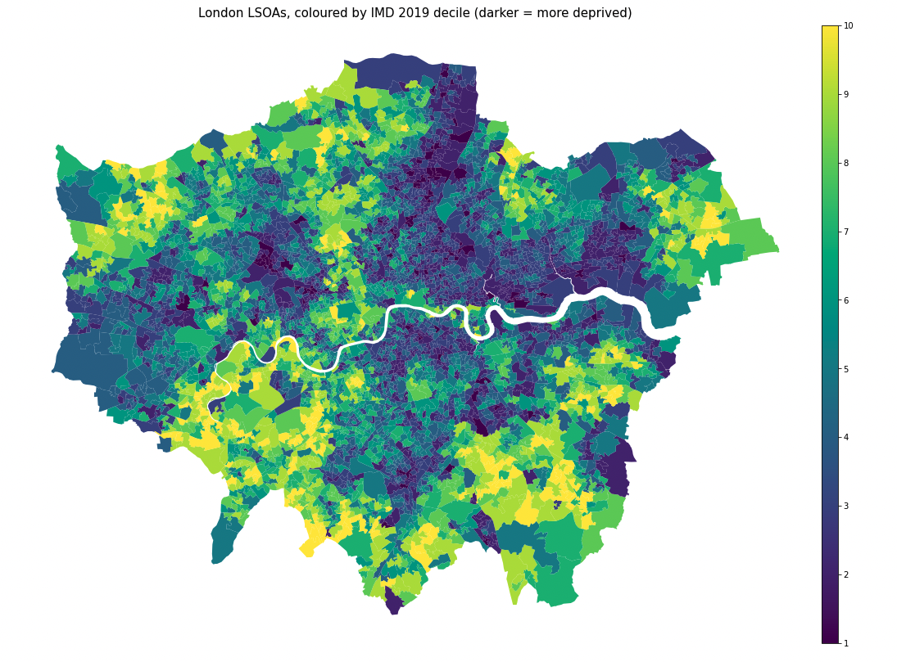
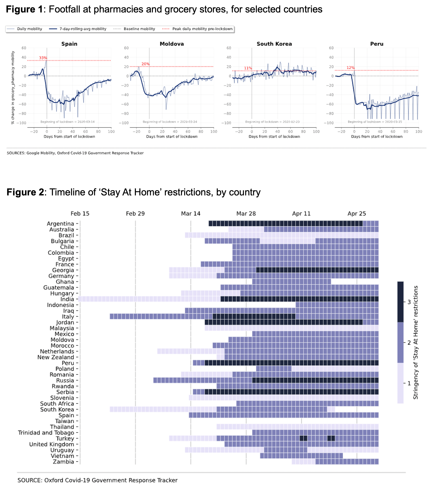
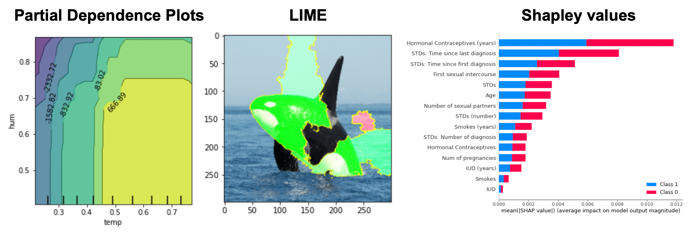
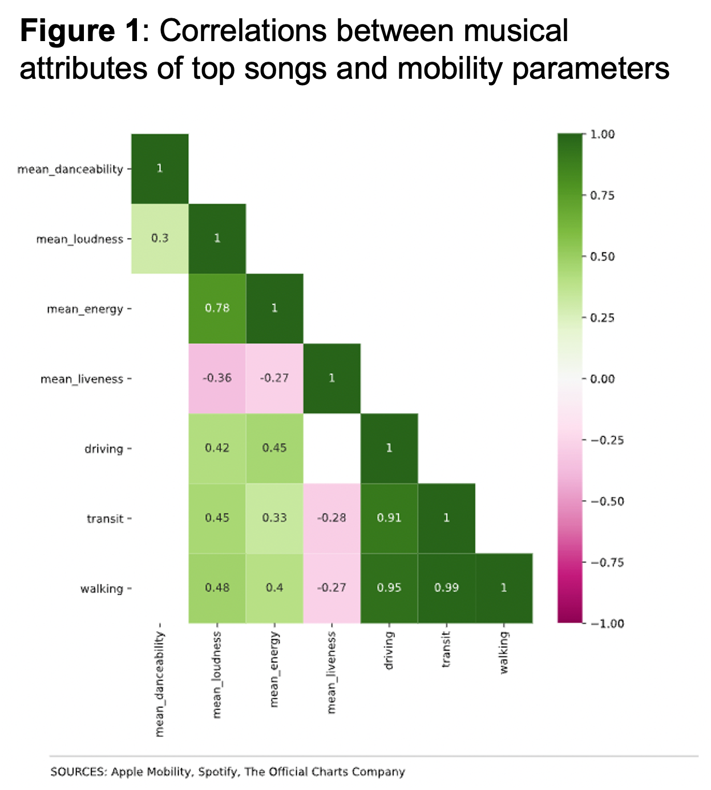

## Projects

#### NLP : Emotions, Sentiment and Emotion Analysis

The project focuses on NLP with a primary objective of sentiment and emotion analysis — developing a system to accurately determine sentiment in text and identify underlying emotions, with scores to quantify intensity.

  
  
  

[View code on Colab](https://colab.research.google.com/drive/1IG_FeO0uGgLT7Lr9biKxl3np3qDkCxvO)

#### Time Series : Workspace Occupancy Post Covid

Forecasting commercial workspace occupancy post-COVID using historical occupancy data and contextual factors to help businesses optimize space management and resource allocation.

  
  
  

[View code on Colab](https://colab.research.google.com/drive/11ZOiF-8OhTTWAfMNYeavqCztir4MFsfg)

#### Clustering : Employee Network Analysis

Identifying clusters of employees with similar communication and collaboration patterns using KNN imputation, LASSO, Random Forests, XGBoost, and Bayesian hyperparameter optimisation.

  
  

[View code on Colab](https://colab.research.google.com/drive/11ZOiF-8OhTTWAfMNYeavqCztir4MFsfg)

#### Regression / Classification : Capital Spend What-if Tool

A what-if tool for capital spending advice using regression and classification to simulate scenarios and predict optimal expenditure decisions along a defined glidepath.

  
  

[View code on Colab](https://colab.research.google.com/drive/11ZOiF-8OhTTWAfMNYeavqCztir4MFsfg)

#### Employee Cluster Analysis : Interactive Motion Chart

Interactive bar motion chart showing how employee clusters evolve over time, built with Plotly.

  <iframe
    src="images/ClustersBarMotionChart.html"
    title="Interactive bar motion chart"
    aria-label="Interactive bar motion chart showing employee cluster analysis"
    loading="lazy">
  </iframe>

